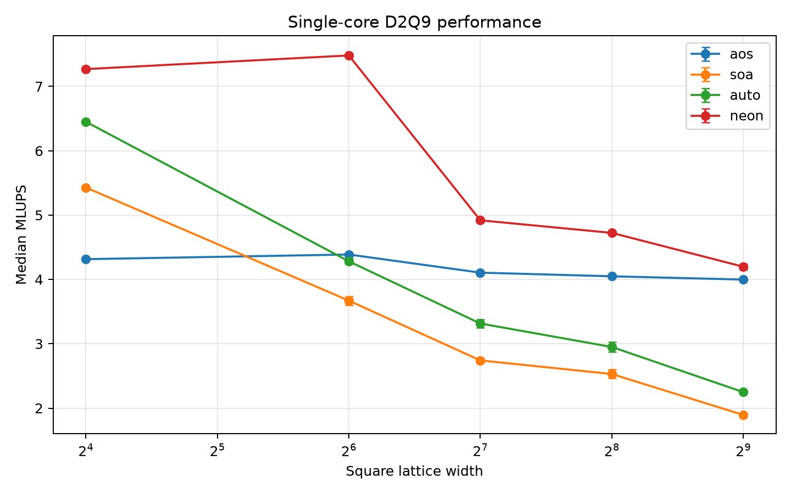
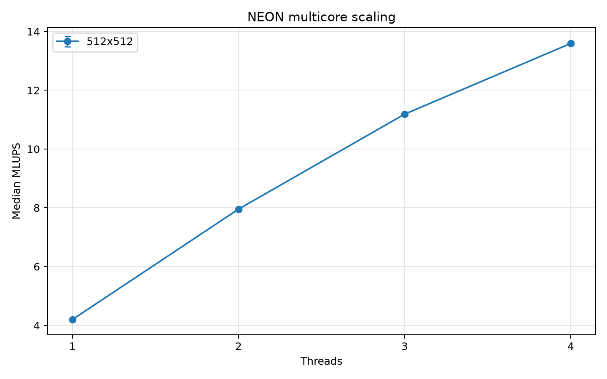

# Efficiency over power

A C11 optimization study on a Raspberry Pi 3 Model B+. I built it as a
hands-on systems project because I wanted to understand how data layout, SIMD,
and multiple cores behave on real, limited hardware.

The workload is a D2Q9 lattice-Boltzmann simulation of a periodic Taylor–Green
vortex. It is small enough to study closely, but it still produces a numerical
result that can be checked for mass conservation, velocity error, and finite
values. The benchmark reports throughput only after the simulation has been
validated.

Here, “efficiency over power” means making effective use of available compute
resources. The project does not measure electrical power, watts, or joules.

## What is compared

The repository contains four implementations of the same update:

| Kernel | Implementation |
|---|---|
| `aos` | Array of Structures, with compiler vectorization disabled |
| `soa` | Structure of Arrays, with compiler vectorization disabled |
| `auto` | SoA interior loop prepared for compiler vectorization under strict floating-point rules |
| `neon` | SoA with explicit 128-bit ARM NEON intrinsics |

These are practical implementation variants, not a perfectly isolated
one-variable experiment. For example, the `auto` loop is also written more
explicitly than the scalar SoA loop so the compiler can analyze it.

SoA suits NEON because four adjacent cells from one distribution can be loaded
directly into a single 128-bit vector.

The multicore test runs the NEON implementation with one to four worker
threads using static row decomposition. Allocation, initialization,
validation, and CSV output are outside the timed simulation.

## Raspberry Pi 3 results

The accepted reference run used a fan-cooled, 32-bit Raspberry Pi 3 Model B+
with GCC 14.2.0. It recorded 240 finite samples and no firmware throttling.
The highest temperature recorded by an individual sample was 54.768 C.

| Result | Measurement |
|---|---:|
| NEON speedup over AoS at 16x16 | 1.68x |
| NEON speedup over AoS at 512x512 | 1.05x |
| One-core NEON at 512x512 | 4.20 MLUPS |
| Four-core NEON at 512x512 | 13.59 MLUPS |
| Four-core speedup and efficiency | 3.24x and 81.0% |

MLUPS means millions of lattice updates per second; higher is better. Values
are medians from repeated measurements, with median absolute deviation (MAD)
reported in the detailed results.





### Interpretation

Explicit NEON was the fastest implementation at every tested grid size. Its
advantage over AoS decreased as the grid grew: from 1.68x at 16x16 to 1.05x at
512x512. This pattern is consistent with increasing cache and memory costs,
but the available counters are not enough to prove that memory bandwidth was
the only bottleneck.

Changing to SoA did not guarantee a speedup. The scalar SoA implementation was
faster than AoS at 16x16 and slower at every larger size. This is a useful
reminder that layout, access pattern, generated instructions, and working-set
size have to be considered together.

Four NEON threads reached 3.24 times the one-thread throughput. That is strong
scaling for four cores, although it is below the ideal 4x. Synchronization and
shared hardware resources are possible contributors; this experiment does not
separate their individual costs.

Under strict floating-point semantics, GCC 14 did not vectorize the `auto`
kernel's interior loop on ARMv7. A separate diagnostic build using relaxed
math did produce 16-byte and 8-byte vector loops. That build is kept outside
the primary comparison because it changes floating-point semantics.

The complete tables, methodology, compiler evidence, PMU profile, and limits
are in [docs/RESULTS.md](docs/RESULTS.md). The accepted data are stored under
[`results/pi3/reference-2026-08-06/`](results/pi3/reference-2026-08-06/).

## Build and test

The scalar implementations are portable C11. On non-ARM systems the NEON
kernel is unavailable and is skipped.

```sh
make
make test
./build/lbm_bench --kernel all --nx 128 --ny 128 \
  --steps 500 --warmup 20 --repetitions 10 --threads 1
```

On a Raspberry Pi 3 running a 32-bit hard-float system:

```sh
make rpi3
make test
./build/lbm_bench --kernel neon --nx 512 --ny 512 \
  --steps 500 --warmup 20 --repetitions 10 --threads 4 --pin
```

Run `./build/lbm_bench --help` for all options. `--pin` requests Linux CPU
affinity; it does not change privileged system settings.

## Reproduce the experiment

After building and testing on the Pi:

```sh
sh scripts/run_tests.sh
sh scripts/profile_perf.sh
```

The sweep waits for the processor to cool below 55 C before each sample and
rejects the run if Raspberry Pi firmware reports throttling. Reboot before an
accepted run so any latched throttle flags begin at zero.

Generate the plots with the optional Python tooling:

```sh
uv sync
uv run python scripts/plot_results.py \
  results/pi3/reference-2026-08-06/benchmark-20260806T100835Z.csv \
  --output-dir results/pi3/reference-2026-08-06/plots
```

## Limits

The measurements come from one actively cooled board, one compiler version,
an `ondemand` frequency governor, and one periodic single-precision model. The
PMU data contain one profile and cannot identify every cache level reliably.
The natural follow-up is to repeat the validated experiment with an external
power meter and report energy per lattice update.

Licensed under the MIT License.
